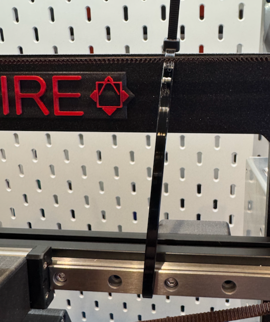
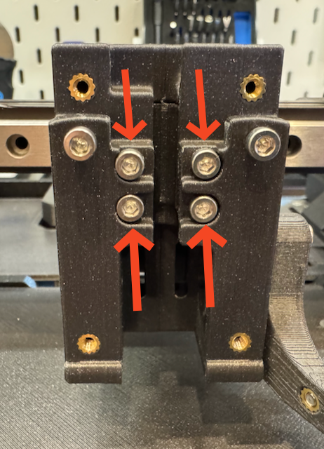
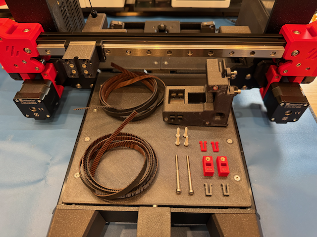
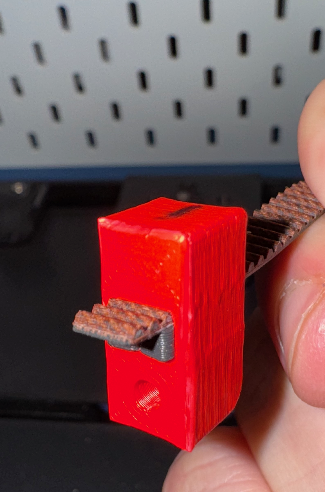
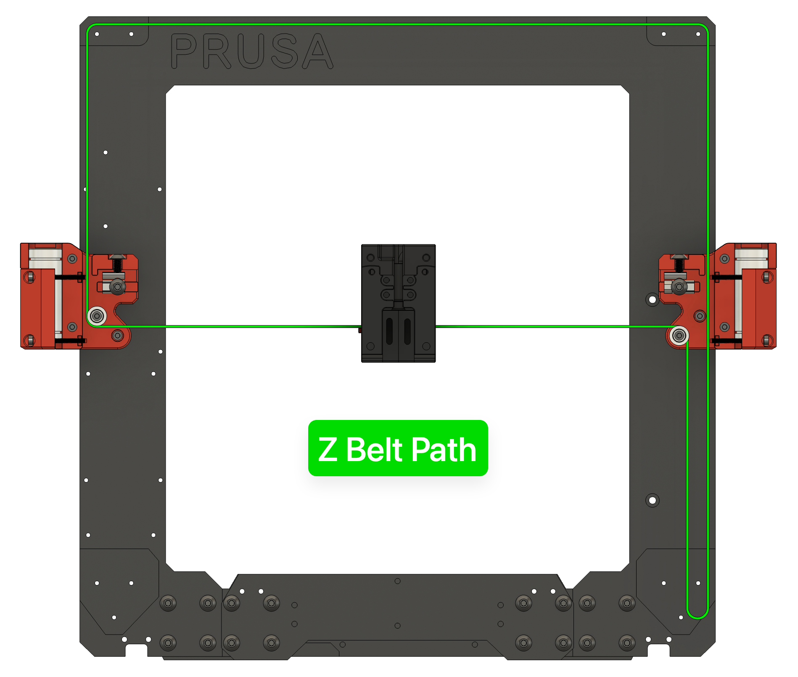
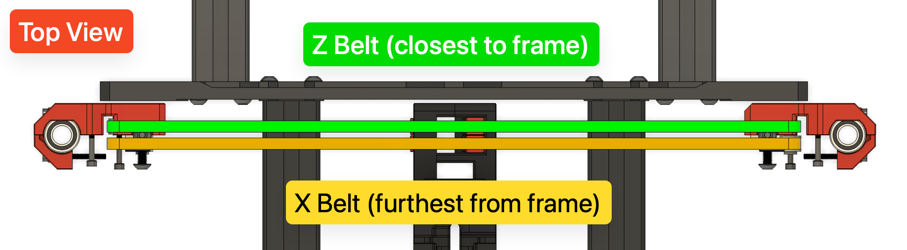
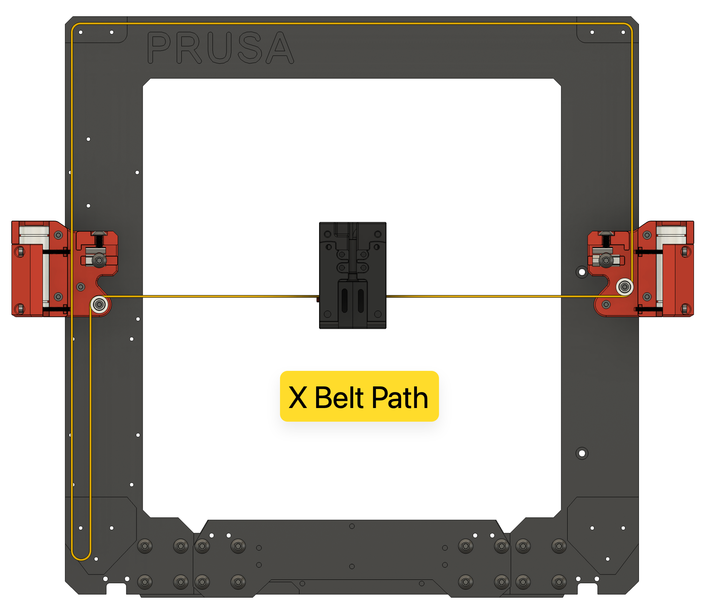
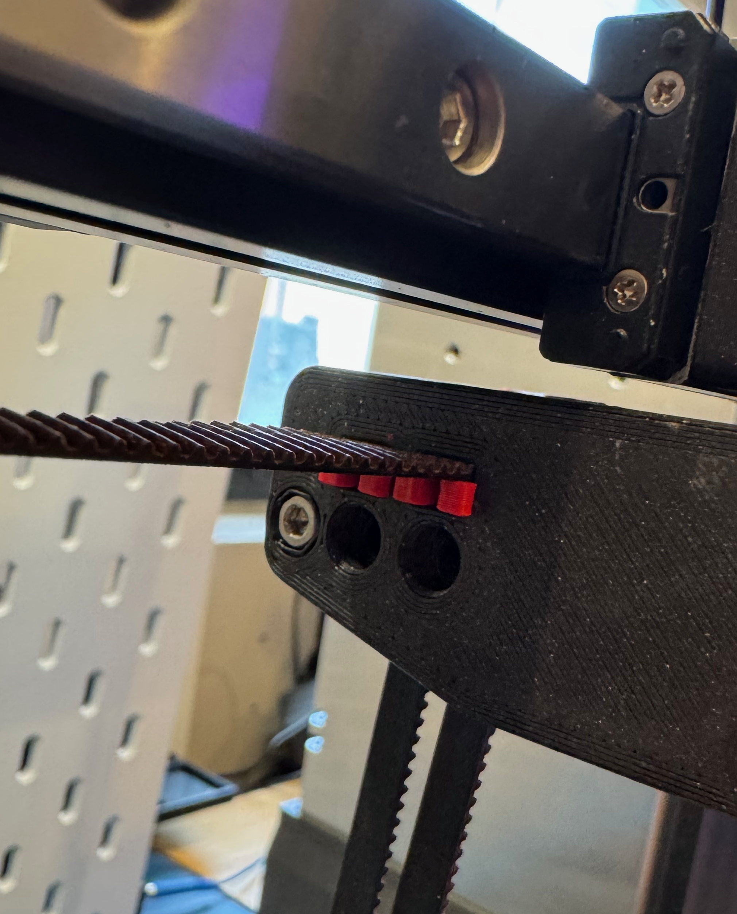
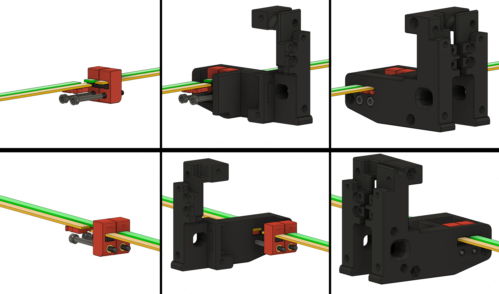
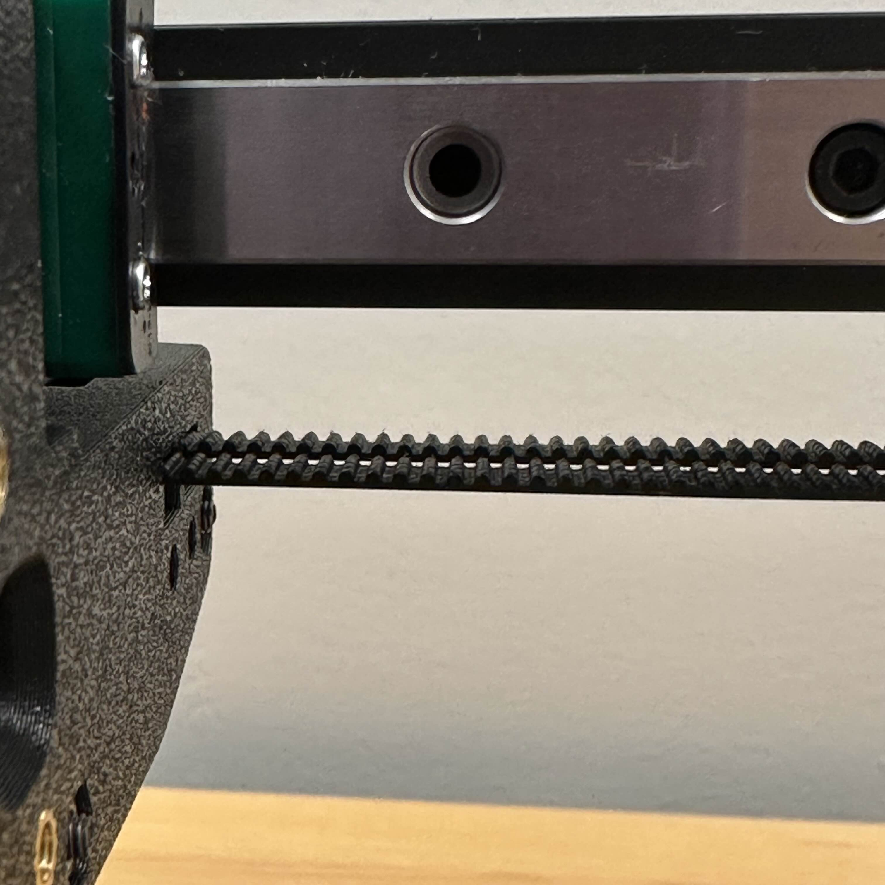

# Prusawire XZ Belt Installation and Tensioning
*This procedure incorporates initial advice from @ellafoxo and others from the Positron Discord.*

**Compatibility:** *Prusawire - Beta 1*

## Overview
The X and Z belts must be installed and tensioned properly to ensure smooth and accurate gantry motion.

**Important notes:**
- Extra belt length has been specified in the BOM; it is expected to have some leftover belt afterwards.
- Match your belt lengths before assembling the printer!
- When inserting the belt clips, there should be an equal number of teeth sticking out of the ends.
- **DO NOT cut your belts** until you are 1000% certain you have done it correctly.  It's okay to leave a little extra length hanging out the back of the toolhead carriage until final assembly and validation.

## Prerequisites
- Complete the Gantry Deracking procedure.
- Remove the **toolhead** from the **carriage mount** (if currently installed).
	1. For Stealthburner, see the Stealthburner assembly manual for instructions.
- (Optional, but highly recommended) Print and assemble the GT2 Belt Runner to easily and perfectly match your belt lengths: [Belt Runner - GT2 Belt Length Matcher \| Printables.com](https://www.printables.com/model/1192440-belt-runner-gt2-belt-length-matcher)

## Instructions 
### Belt Installation
1. Measure out 1600mm of GT2 belt for the X axis.  Double-check your measurement, then cut this length.  Set aside for now.
	- *Tip: Mark some tape on your desk with 100mm increments using a tape measure or calipers.*

    

2. Measure out another ~1600mm length of GT2 belt for the Z axis.  **Do not cut it yet!**
3. Match the belt lengths (*note: if not using the GT2 Belt Runner, carefully match the belt lengths by hand!*)
	1. Align the starting teeth of the of the X belt and Z belt.  
	2. Feed into the GT2 Belt Runner (see above).  
	3. Use belt runner to find the exact same length of Z belt as X belt.  Note one belt will be exactly one tooth offset from the other.  
	4. Once you are sure the belts are the same length, cut the **Z belt** to match the **X belt**.

    
	
4. Using tape or a zip tie, raise the gantry about 75% of the way towards the top of the frame.

    
	
5. Remove the 4x **M3x14 SHCS** securing the **x carriage assembly** to the linear rail.  Remove the assembly.
	
    

6. Remove the 3x **M3x40 SHCS** from the left side of the **x-carriage assembly** to separate the left side from the right side.
	
    

7. Gather all the needed parts:
	- 2x **1600mm Gates GT2 Belt**
	- 2x **M3x40 SHCS**
	- 2x **\[a]_belt_tensioner_clip**
	- 2x **\[a]_belt_clip**
	- 2x **belt_clip**
	- 4x **M3x14 SHCS**
	- 1x **x-carriage - left side**
	- 1x **x-carriage - right side**

    
    
8. Take the **x-carriage - right side** and install it back onto the **x-carriage mount** (on the rail) with 2x **M3x14 SHCS**.
9. Take the first **\[a]_belt_tensioner_clip**.  Feed a small amount of one of the belts (belt teeth facing up) through the slot on the side with the heat insert.  Pass just enough belt through so 3 teeth are visible from the opposite side.  Insert a **belt_clip** under to secure.
	- *Tip: You can press the retaining clip against a flat surface to help force the retaining clip into the tensioner clip.*
    
    

10. Repeat this process for the other clip and belt.  It is critical for both clips to have the same number of exposed belt teeth showing.
11. Pass the long end of each belt (teeth facing up) through the two slots from the inside to the outside of the mounted **x-carriage - right side**.
	- *NOTE: The **\[a]_belt_tensioner_clip** with the single dot goes towards the rear of the printer.  The clip with the two dots goes towards the front of the printer.

    

12. **Z Belt**: Route the belt through the belt path (see diagram; belt path noted in GREEN):
	1. Right towards the **XZ Block - Right**.
	2. Around the bearing stack and down towards the **Z Motor**.
	3. Back up around the **Z Motor Pulley** through the **XZ Block - Right** towards the **Idler Block - Right**.
	4. Around the bearing stack and left towards **Idler Block - Left**.
	5. Around the bearing stack and down towards **XZ Block - Left**.
	6. Around the bearing stack and right towards the **X-carriage**.
	7. *Tip: Make sure the belt isn't twisted at any point!*
	8. *Tip: Check the Z Motor Pulley alignment with the belt.  Adjust with the set screws on the pulley if needed to ensure good belt alignment that doesn't rub on the motor mounts.*

    
    

13. **X Belt**: Route the belt through the belt path (see diagram; belt path noted in YELLOW):
	1. Right towards the **XZ Block - Right**.
	2. Around the bearing stack and up towards **Idler Block - Right**.
	3. Around the bearing stack and left towards **Idler Block - Left**.
	4. Around the bearing stack and down through **XZ Block - Left** towards **X Motor**.
	5. Back up around the **X Motor Pulley** towards **XZ Block - Left**.
	6. Around the bearing block and right towards the **x-carriage**.
	7. *Tip: Make sure the belt isn't twisted at any point!*
	8. *Tip: Check the X Motor Pulley alignment with the belt.  Adjust with the set screws on the pulley if needed to ensure good belt alignment that doesn't rub on the motor mounts.*

    
	
14. Pass the two belts through the outside of the **x-carriage - left side**.  
	
    

15. Rejoin the **x-carriage - left side** to the mounted carriage with the 3x **M3x40 SHCS**.  Direct the excess belt length down for now.

    

16. Pull the excess belts evenly to remove the slack from the belt system.  Carefully line up the ends of the belts to ensure they are the same length and the ends match up evenly.
17. Insert both **\[a]_belt_clips** to secure the belts to the left side of the carriage.

    

18. Confirm once again the ends of the belts are perfectly aligned.  If they have shifted, remove the clips and re-adjust.
19. Unmount the **x-carriage assembly** from the linear rail one last time by removing the 2x **M3x14 SHCS** from the front.
20. Carefully rotate the assembly towards you to view the belts inside.

    

21. Leaving 3 to 4 teeth exposed on the left side of the assembly, carefully cut the belts.

	![[belt-cut.png|300]]

22. Re-mount the assembly back onto the linear rail carriage with all 4x **M3x14 SHCS**.
23. Install the 2x **M3 x 40 SHCS** into the left side of the **x-carriage assembly** and screw into the **\[a]_belt_tensioner_clips** until just seated.
	
    

24. You are finished and ready to tension the XZ Belts!

    
	

### Belt Tensioning
To properly tension the X and Z belts:
1. Begin turning the two **M3x40 SHCS tensioning screws** in the **x-carriage assembly**.
	- Turn clockwise to increase tension.
	- Turn counterclockwise to decrease tension.
2. Once slack is removed, and prior to final tension:
	- **TRIPLE CHECK YOUR BELTS to make sure they are riding correctly on the bearings and pulleys.  If they aren't, loosen and correct.**
3. If the tensioning screw bottoms out you can either:
	- Replace the M3x40 SHCS with a fully threaded version
	- Try tensioning both belts a few more groove notches on the left side of the **x-carriage assembly** and re-installing the **\[a]_belt_tensioner_clips** to secure.

4. Visually inspect your X carriage belt tensioner. If your belts are not stretched, you should see that the two tensioner blocks are almost in line with one another. 
	
    
    
5. Come to the front of the printer and inspect the right side of your X carriage. Your belt teeth should align with one another. If they do not, make minor adjustments to the tensioner screws until they do.
	
    

6. Follow up with tuning your belt tension with one of the final tensioning options below.

**Final Tensioning Options:**
- **PF Makes Belt Tensioning Meter:** [3D-Printer/GT2 Belt Tension Meter at main · Diyshift/3D-Printer · GitHub](https://github.com/Diyshift/3D-Printer/tree/main/GT2%20Belt%20Tension%20Meter)
	- Switchwire "Z" Spec - 1.8 to 2.2 (1.9 to 2.3 for EPDM high-temp belt)
- **Prusa Belt Tension Gauge:** [Tension Meter for the GT2 belts of i3 MK3S+ or Prusa MINI+ by Prusament \| Download free STL model \| Printables.com](https://www.printables.com/model/46639-tension-meter-for-the-gt2-belts-of-i3-mk3s-or-prus)
- **Biqu's Digital Belt Tension Tool:** [GitHub - bigtreetech/Belter-belt-tension-Tool: Belter belt tension Tool Info Page](https://github.com/bigtreetech/Belter-belt-tension-Tool)
- **Prusa Mobile App:** 
	- [Prusa on the Apple App Store](https://apps.apple.com/us/app/prusa/id6477531937)
	- [Prusa - Apps on Google Play](https://play.google.com/store/apps/details?id=com.prusa3d.connect&hl=en-US&pli=1)
	- Tuner Mode for *MK3S --> X-Axis*
		- Carriage all the way to the right
- **Prusa Website Tuner:** [Prusa Belt tuner](https://belt.connect.prusa3d.com/)
	- *MK3S --> X-Axis*
		- Carriage all the way to the right
- **Gates Carbon Drive Mobile App**
	- [Carbon Drive Belt Tension Tool on the Apple App Store](https://apps.apple.com/app/bicycle-belt-tension-meter/id438346486)
	- [Carbon Drive - Apps on Google Play](https://play.google.com/store/apps/details?id=com.gates.carbondrivecalculator&hl=en)
	- 85 Hz